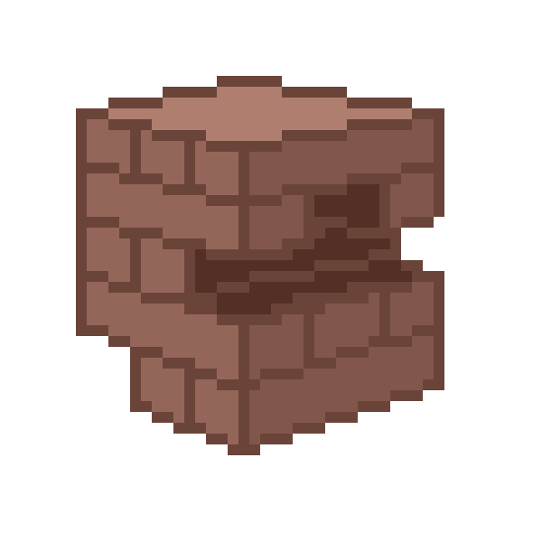

``Run newJenga.py to play the game!``
or click [here](https://colab.research.google.com/drive/19a5Txou5FBvB1GbNrer2pruKfoIVDkN9#scrollTo=ME5X9ya5DSxm) to play on Google Colab!

# Description
___
Welcome to our project!

In this project we sought to build a digital version of the game _Jenga_. 

___
# Table of Contents 

| | Description |
|-|------|
|Unfamiliar with Jenga?|Explains the main concepts related to the Jenga boardgame. If you have prior knowledge you can skip this section|
|Data Structures| Section of listed Data Structures as well as why and how we implemented them into the project.|
|Algorithms| Section of listed Algorithms as well as why and how we implemented them into the project|
|Project Analysis: Time Complexity| This section delves into the time complexity of the chosen Algorithms and how they function with the Data structures that we have implemented|

___

# Unfamiliar with _Jenga_? 

## Rules and objective of the game

In this version of *Jenga* the players competes to get the heighest amount of moves before the tower collapses. The player removes one block at a time from a tower constructed of 54 blocks or 18 layers. Each block removed is then placed on top of the tower, creating a progressively more unstable structure.

Starting off, the player starts removing one block from any layer below the highest two, and placing it horizontally atop the tower, perpendicular to any blocks on which it is to rest.

Once a level contains three blocks, it is complete and may not have any more blocks added to it.

The game ends when any portion of the tower collapses, caused by either the removal of a block or its new placement. The player with the highest score wins the game.
___
# Data Structures

## 3D matrix (Tower) :

- Since we wanted to make a vertical tower with dynamic levels and valued pieces, we immediately identified that in the game of _Jenga_, a three dimensional matrix would be the most effective data structure to store and manipulate all the values.
### Reasons :
1. **Spatial Representation:**
    - _Jenga_ towers are three-dimensional structures, and a 3D matrix is well-suited for spatial representation. Each element in the matrix corresponds to a specific location in the tower, allowing for an intuitive and accurate representation of the tower's structure.
2. **Layered Structure:**
    - The tower consists of layers of _Jenga_ blocks, and the 3D matrix can be used to organize these layers. Each layer is represented as a 2D matrix within the 3D matrix, with individual elements representing the presence or absence of a _Jenga_ block at a specific position and the orientation of the layer itself (vertical/horizontal).
3. **Ease of Manipulation:**
    - Manipulating the _Jenga_ tower involves adding or removing blocks at specific positions. The 3D matrix provides a straightforward way to perform these operations, as each element in the matrix corresponds to a block in the tower.
4. **Efficient Indexing:**
    - Accessing specific positions within the tower is efficient using 3D matrix indices. The indices can be used to locate and modify the state of a particular block in constant time (O(1)).
5. **Visualization:**
    - The 3D matrix facilitates the visualization of the tower's structure in the code. Developers can easily understand and reason about the state of the tower by examining the matrix, making it a valuable tool for debugging and code comprehension.

## Array (Leaderboard) :

- The simplest way for us to have stored the leaderboard values during a match was using an array, with long term storage on a .txt document. This allowed us to easily implement a sorting algorithm every time the scores where updated. As such we opted to use a standard Array. Furthermore, there are more reasons for this choice.
### Reasons :

1. **Leaderboard Representation:**
    - An array is utilized to represent the leaderboard in the _Jenga_ game. Each element in the array corresponds to a player and is associated with their score. The array is sorted in descending order based on player scores, with the highest score at the top of the leaderboard.
2. **Simple and Direct Indexing:**
    - The array allows for simple and direct indexing, where each player's score is associated with their position in the array. This simplicity facilitates straightforward access and modification of player scores.
3. **Efficient Sorting:**
    - The array is sorted in descending order based on player scores. This allows for efficient sorting of the leaderboard, which is a key feature of the _Jenga_ game. The leaderboard is sorted after every score update, ensuring that the player with the highest score is positioned at the top of the leaderboard.
### Key Details:

- **Insertion and Retrieval:**
    - The time complexity for inserting a new score or retrieving an existing score from the array is `O(1)` because array indexing is a constant time operation.
- **Sorting (if needed):**
    - If sorting is required for the leaderboard, the time complexity would be O(n log n) for the sorting operation using **quicksort**. However, this might be a periodic operation rather than occurring after every score update.

## Circular Queue (Stacked Queue as we saw in class):

- A *circular queue*, also known as a circular buffer, is a type of data structure that combines the features of a queue and an array (stack). It is a way to represent a queue with a fixed-size array, and when the end of the array is reached, the next element is considered to be at the beginning of the array, creating a circular structure. 

- For the tracking of the moves we used a circular queue. This was a simple choice especially because of the nature of the data structure. Simply put, we would have the moves placed at the top of the stack following a LIFO, which would make backtracking an easy operation for us when it came for the time to implement it. Since we are allowing for a maximum of 3 backtracking operations, we need to only keep track of the last 4 elements. Therefore, the circular queue lets us pop the first element (FIFO) after the length is greater than 4. This data structure allows us to keep a time complexity of O(1) in all push/pop operations.

- For our case, we will be using the deque() object from collections to implement this function. This essentially lets us keep the best of both worlds from a queue and a stack, while still keeping its efficiency.

1. **Backtracking Operations:**
    - A stack is employed to facilitate backtracking operations in the _Jenga_ game. As a player makes moves and can potentially undo them, the stack keeps track of the sequence of moves, allowing for efficient undoing of the last move.
2. **Last-In-First-Out (LIFO):**
    - The stack follows the Last-In-First-Out (LIFO) principle, where the most recently added move is the first to be removed. This aligns with the nature of backtracking, where the latest move needs to be undone before previous moves.
3. **Efficient Undoing:**
    - The stack's LIFO behavior allows for efficient undoing of moves. Popping the top of the stack corresponds to undoing the last move made in the game.
4. **FIFO:** 
    - After the length of the array is more than the desired, we are able to efficiently pop the first element in following FIFO sequence.

### Key Details:

- **Push and Pop Operations:**
    - The time complexity for push (adding a move to the stack) and pop (removing the last move from the stack) operations is typically `O(1)`. These operations are constant time and don't depend on the size of the stack.

#### Considerations in the _Jenga_ Game:

- **Undoing Moves:**
    - The stack is crucial for implementing the backtracking mechanism in the game, allowing a player to undo moves and explore different paths in the gameplay given the current scenario.

___
# Algorithms:

## Backtracking with a Circular Queue: `O(1)`

1. **Undoing Moves (Backtracking):**
    - Undoing a move with a circular queue involves popping the top element of the circular queue, just like in a stack. This operation is a constant time operation `O(1)` since it directly accesses the top of the stack.
2. **Inserting Moves (Adding to the Queue):**
    - When a new move is made, it needs to be pushed onto the stack. This operation is also a constant time operation `O(1)` as it involves adding an element to the top of the stack.
3. **Deleting Moves (Removing from the Queue):**
    - Removing the first enqueued move when the buffer limit has been reached (4). Like inserting operations, this  is a constant time operation of `O(1)`.

####  **Key Advantages:**

1. **Flexibility:**
    - Backtracking provides flexibility by allowing players to explore different move sequences. 
2. **Error Correction:**
    - In a game with complex rules and potential for mistakes, backtracking serves as a mechanism for error correction. If a player realizes that a move has negatively impacted the tower's stability, they can backtrack to a previous state and try an alternative approach.

#### **Considerations**:

- **Space Complexity:**
    - Using a stack for backtracking may have implications for space complexity, especially if the stack becomes large. In the other hand, a queue would be efficient in space complexity, but would not satisfy our needs of removing the most-recently added element. **Therefore,** a circular queue is the best option for both, computational efficiency (`O(1)`) and space complexity, taking the least amount of space needed. 

## QuickSort : `O(n log n)`

- **Leaderboard Sorting:**
    - QuickSort is employed to sort the leaderboard in descending order based on player scores. This ensures that the player with the highest score is positioned at the top of the leaderboard, providing a clear and easily interpretable ranking.

#### **Key Advantages:**
1. **Recursion:**
	- QuickSort utilizes recursion as a key element of its sorting strategy. The algorithm recursively divides the array of scores into smaller subarrays, sorting each subarray independently.
2. **Efficient Sorting:**
    - QuickSort in the context of a leaderboard, where scores are dynamic and change frequently, the ability to quickly re-sort the leaderboard is essential for maintaining an up-to-date ranking.
3. **Descending Order:**
    - Sorting in descending order is important for leaderboard presentation. QuickSort, with its average time complexity of `O(n log n)`, ensures fast sorting even for larger leaderboards if this were to support a larger playerbase.

## Linear Search for Tower Balance: `O(n)`

- To update the Balance of the tower, we use Linear Search which has a time complexity of `O(n)`, meaning that we go through the entire tower as one piece's change will impact the balance of the layers in each as well.

1. **Checking Tower Balance:**
    - Linear search is employed to check the balance associated with the state of each layer in the _Jenga_ tower. The algorithm traverses the tower matrix to identify relevant conditions that contribute to the overall balance calculation. For example, if a layer has a side and center piece missing, it will undoubtedly cause the layer to fall.
2. **Dynamic Balance Evaluation:**
    - The balance of the tower is dynamic and changes with each move. Linear search allows for efficient evaluation of the tower's balance after each move, ensuring that the tower's stability is accurately represented.

___
# Project Analysis: Time Complexity

## Table Summary
| **Algorithm** | **Decription** | **Time Complexity (Worst Case)** | **Time Complexity (Average Case)** |
|-|-|-| - |
| **Backtracking** | Ability to go back after each move if you don't feel you removed the right piece | `O(1)`| `O(1)` |  
| **QuickSort** | sed to sort the leaderboard in descending order | `O(n^2)` | `O(n log n)`|
| **Linear/Sequential Search**| Used to update the tower's balance and probability of collapsing after each move made| `O(n)` | `O(n)` |

## Backtracking : `O(1)`

- The time complexity of backtracking with a circular queue for each operation is of O(1). In the worst possible scenario we would have to go through the entire stack giving us a time complexity of `O(4)` since that is the maximum length of the circular queue, however, the operations that go through the stack themselves are of `O(1)` time complexity. The operations of note would involve:

1. **Undoing Moves (Backtracking):**
    - In a stack, undoing a move involves popping the most recent move, thus making the previous move now the current one. This operation is typically done in constant time `O(1)`.
    
1. **Inserting Moves (Adding to the Stack):**
    - When a new move is made, it needs to be added to the stack via a push. This operation is essentially just adding the new move into the top of the stack and is usually a constant time operation  of  `O(1)`.
    
1. **Deleting Moves (Removing from the Stack):**
    - Similar to Undoing Moves, removing a move during backtracking involves popping from the stack. This operation is, again, a constant time operation `O(1)` because, in a stack, the move will be at the top. For all intents and purposes, this is the same as backtracking.

## QuickSort : `O(n log n)`

1. **Average Case Time Complexity:**
    
    - The average time complexity of QuickSort is `O(n log n)`. This is based on the partitioning of the array and the recursive sorting of subarrays. In the average case, QuickSort efficiently sorts the leaderboard array.
2. **Worst Case Time Complexity:**
    
    - The worst-case time complexity of QuickSort is `O(n^2)`. This occurs when the pivot is consistently chosen as the minimum or maximum element, leading to unbalanced partitioning. However, in practice, the worst case is uncommon, especially with good pivot selection strategies.
3. **Data Characteristics:**
    
    - The leaderboard likely contains a small number of scores, and the data is not expected to be highly unorganized. QuickSort is well-suited for efficiently sorting small to moderately-sized arrays with random or semi-random data.

## Linear Search : `O(n)`

#### Time Complexity:

- **Average Case:**
    - For the average case, Linear search will run at `O(n)` time complexity, where n is the amount of layers in the matrix. This is because we will have to go through each layer to evaluate the stability of the tower. This is a negligible time complexity since we do not have to scale the game, but it is still important to note.
- **Worst Case:**
    - For the worst case, Linear search also has an `O(n)` time complexity. In the worst case, the search operation needs to traverse the entire tower matrix to evaluate its stability. Which although a negligible for the most part in this game since we do not have to scale it the game, we would normally look for a better method to look over the balance.

___
